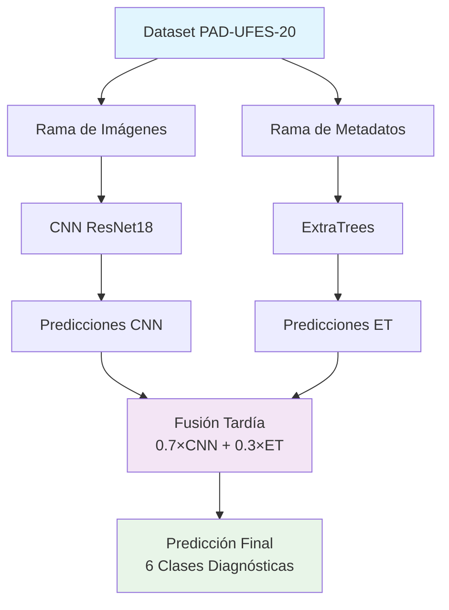

# 🔬 Clasificación de Lesiones de Piel con PAD-UFES-20

<div align="center">


**Sistema híbrido de ML para clasificación automática de lesiones de piel usando CNN + ExtraTrees en el dataset PAD-UFES-20**

[Características](#-características) • [Inicio Rápido](#-inicio-rápido) • [Arquitectura](#-arquitectura) • [Documentación](#-documentación)

</div>

---

## 🎯 Visión General

Este repositorio implementa un sistema **económico y eficiente** de aprendizaje automático híbrido para clasificación de lesiones de piel usando el dataset **PAD-UFES-20**. El sistema combina:

- 🖼️ **CNN (ResNet18)** → Análisis de imágenes dermatoscópicas
- 📊 **ExtraTrees** → Procesamiento de metadatos clínicos  
- 🔗 **Fusión Tardía** → Combinación óptima de predicciones

### 🏥 Dataset PAD-UFES-20
- **2,298 muestras** de población brasileña
- **6 clases diagnósticas**: ACK, BCC, MEL, NEV, SCC, SEK
- ✅ Diversidad étnica • ✅ Metadatos clínicos • ✅ Validación histopatológica

## ✨ Características

- 🔥 **Rama CNN**: ResNet18 con cabeza de clasificación personalizada
- 🌳 **Rama ExtraTrees**: Modelo ensemble con optimización de hiperparámetros
- ⚡ **Fusión Tardía**: Combinación ponderada de predicciones (70% CNN + 30% ExtraTrees)
- 📊 **Balanceo de Clases**: Muestreo ponderado para dataset desbalanceado
- 🎨 **Aumento de Datos**: Transformaciones especializadas para dermatología
- 📈 **Evaluación Completa**: Métricas y visualizaciones automáticas
- 🔧 **Pipeline Reproducible**: Semillas aleatorias fijas e índices guardados

## 🚀 Inicio Rápido

### Prerrequisitos
```bash
Python 3.8+ | PyTorch | scikit-learn | CUDA (opcional)
```

### Instalación
```bash
git clone https://github.com/tuusuario/lowcost-ml-cancer-cnn-extratrees.git
cd lowcost-ml-cancer-cnn-extratrees
pip install -r requirements.txt
```

### Configuración del Dataset
1. Descarga [PAD-UFES-20](https://data.mendeley.com/datasets/zr7vgbcyr2/1)
2. Extrae en la carpeta `data/`:
```
data/
├── imagenes/          # 2,298 imágenes dermatoscópicas
└── metadata.csv       # Información clínica
```

### Pipeline de Entrenamiento
```bash
# 1. Preprocesamiento de datos
python data_preparation.py

# 2. Entrenar modelo CNN
python cnn_modelv3.py

# 3. Entrenar modelo ExtraTrees  
python extratrees_model.py

# 4. Combinar predicciones
python late_fusion.py

# 5. Generar reporte de evaluación
python metrics_and_plots.py
```

## 📊 Resultados

El sistema genera resultados de evaluación completos incluyendo:

- **Rendimiento individual** (CNN, ExtraTrees)
- **Rendimiento combinado** (Fusión Tardía)
- **Métricas por clase** (Precisión, Recall, F1-Score)
- **Matrices de confusión** para todos los modelos
- **Curvas ROC** y puntajes AUC
- **Comparación de modelos** visual

Todos los resultados se guardan automáticamente en el directorio `results/` con reportes detallados y visualizaciones.

### 📈 Salidas Generadas
- 🎭 Matrices de confusión para cada modelo
- 📊 Curvas ROC (multiclase)  
- 📉 Distribuciones de probabilidad
- 🎯 Gráficos de importancia de características (ExtraTrees)
- 📋 Resumen ejecutivo con comparación de modelos

<details>
<summary>📁 Estructura del Directorio de Resultados</summary>

```
results/
├── cnn/                    # Resultados específicos de CNN
│   ├── confusion_matrix.png
│   ├── roc_curve.png
│   ├── metrics.json
│   └── classification_report.csv
├── extratrees/            # Resultados de ExtraTrees
│   ├── confusion_matrix.png
│   ├── roc_curve.png
│   ├── metrics.json
│   └── classification_report.csv
├── combinado/             # Resultados del modelo híbrido
│   ├── confusion_matrix.png
│   ├── roc_curve.png
│   ├── metrics.json
│   └── classification_report.csv
└── comparison/            # Comparación de modelos
    ├── model_comparison.png
    ├── model_comparison.csv
    └── executive_summary.txt
```
</details>

## 🔧 Configuración

### Hiperparámetros CNN
```python
BATCH_SIZE = 32       # Tamaño del batch
NUM_EPOCHS = 30       # Máximo de épocas  
PATIENCE = 3          # Paciencia para early stopping
IMAGE_SIZE = 224      # Resolución de imagen de entrada
```

### Optimización ExtraTrees
```python
n_iter = 50          # Iteraciones de RandomizedSearchCV
cv_folds = 3         # Pliegues de cross-validation
scoring = 'balanced_accuracy'  # Métrica de optimización
```

### Configuración de Fusión
```python
cnn_weight = 0.7     # Contribución de CNN a la predicción final
et_weight = 0.3      # Contribución de ExtraTrees a la predicción final
```

## 🏗️ Arquitectura

<div align="center">



</div>

### 🖼️ Pipeline CNN
- **Entrada**: Imágenes dermatoscópicas 224×224×3
- **Backbone**: ResNet18 (pre-entrenado en ImageNet)
- **Head**: Capas fully connected personalizadas con BatchNorm + Dropout
- **Aumento de datos**: Flip horizontal/vertical, rotación, variación de color, transformaciones afines
- **Optimización**: Optimizador AdamW con scheduler ReduceLROnPlateau
- **Regularización**: Early stopping con paciencia=3

### 🌳 Pipeline ExtraTrees  
- **Entrada**: Metadatos clínicos (edad, sexo, ubicación anatómica, etc.)
- **Preprocesamiento**: Normalización con StandardScaler
- **Modelo**: ExtraTreesClassifier con búsqueda automática de hiperparámetros
- **Optimización**: RandomizedSearchCV con cross-validation estratificado
- **Características**: Datos demográficos y características de lesiones

### 🔗 Estrategia de Fusión Tardía
- **Método**: Promedio ponderado de probabilidades de predicción
- **Pesos**: Empíricamente 0.7 (CNN) + 0.3 (ExtraTrees)
- **Razón**: Las imágenes proveen más información discriminativa que los metadatos solos

## 🚨 Consideraciones Clínicas

### ⚠️ Descargos Importantes
- **NO reemplaza** el diagnóstico médico profesional
- Requiere validación clínica antes de cualquier implementación médica
- Considerar sesgo poblacional (entrenado con datos brasileños)
- Seguir regulaciones apropiadas para dispositivos médicos

### 🎯 Casos de Uso Previstos
- 🩺 **Herramienta de investigación** para análisis de lesiones de piel
- 🎓 **Propósitos educativos** en formación médica
- 🔬 **Estudios académicos** sobre enfoques híbridos de ML
- 📊 **Sistema base** para desarrollo futuro

## 🛠️ Detalles Técnicos

### Archivos de Modelo Generados
- `best_cnn_model.pth` - Pesos del CNN entrenado
- `models/best_extratrees_model.pkl` - Modelo ExtraTrees entrenado
- `models/extratrees_scaler.pkl` - Escalador de características
- Varios archivos `.npy` con predicciones e índices

### Manejo de Datos
- **División estratificada**: 80% entrenamiento, 20% prueba
- **Balanceo de clases**: WeightedRandomSampler para CNN, pesos balanceados para ExtraTrees  
- **Validación de imágenes**: Detección y manejo automático de imágenes corruptas
- **Reproducibilidad**: Semillas aleatorias fijas e índices de train/test guardados

## 🤝 Contribuciones

¡Bienvenidas las contribuciones! Áreas para mejorar:

- 🔬 Estrategias adicionales de fusión (fusión temprana, mecanismos de atención)
- 🏗️ Arquitecturas CNN alternativas (EfficientNet, Vision Transformers)
- 📊 Métricas avanzadas de evaluación y validación clínica
- 🚀 Despliegue y optimización de modelos
- 📚 Documentación y tutoriales


### 📖 Referencia del Dataset
```bibtex
@article{pacheco2020pad,
  title={PAD-UFES-20: A skin lesion dataset composed of patient data and clinical images collected from smartphones},
  author={Pacheco, Andre GC and Lima, Gustavo R and Salomão, Amanda S and others},
  journal={Data in brief},
  volume={32},
  pages={106221},
  year={2020},
  publisher={Elsevier}
}
```

## 📄 Licencia

Este proyecto está bajo la licencia MIT - ver el archivo [LICENSE](LICENSE) para detalles.

---

<div align="center">

</div>
```
